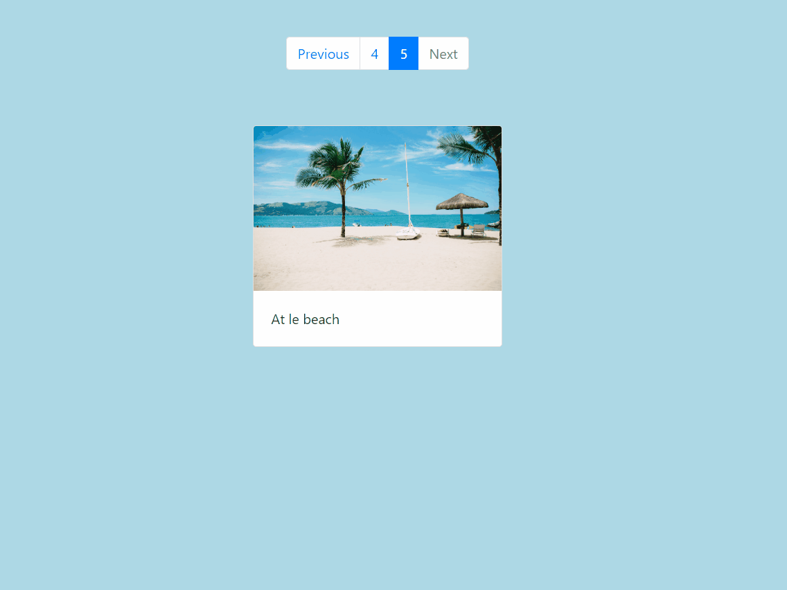
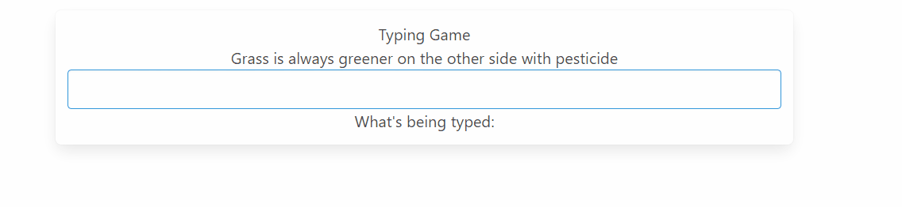

    <h3>Summary</h3>
    

        A list of small Angular projects.
    

<figure class="image-body image-body-large">
    
    <figcaption>Pagination made with Bootstrap UI framework and Angular</figcaption>
</figure>

<figure class="image-body image-body-large">
    
    <figcaption>Typing game with randomly generated dumb phrases</figcaption>
</figure>