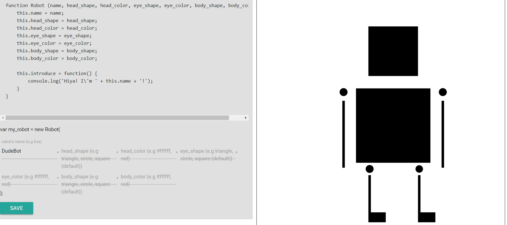

<figure class="image-body image-body-large">
    
</figure>

    <h3>Summary</h3>
    

        A silly little project using Materialize, AJAX, PHP, and CSS Canvas. User can "make" their own robots appearance by filling in the fields.
         
        I wanted to make something interactive and visualize OOP.
    

<figure class="image-body image-body-large">
    
    <figcaption>Input shapes and colors of the robots part. You can even name it!</figcaption>
</figure>