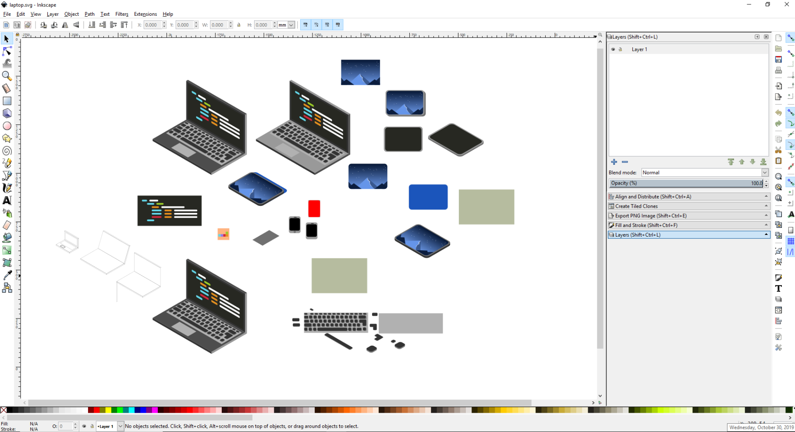

<figure class="image-body image-body-small">
    
</figure>

    <h3>Summary</h3>
    

        Isometrics objects made in Inkscape.
    

<figure class="image-body image-body-medium">
    
    <figcaption>The work table. There was a lot of flipping and turning and shaping involved.</figcaption>
</figure>