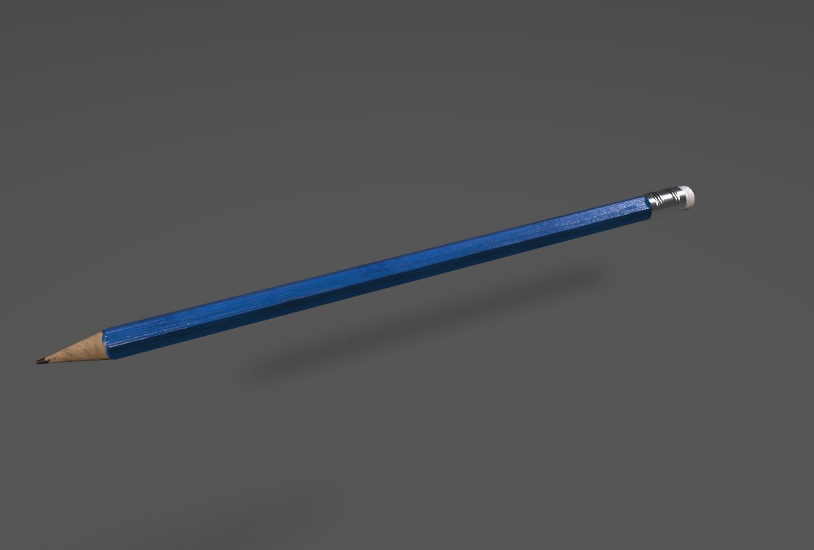
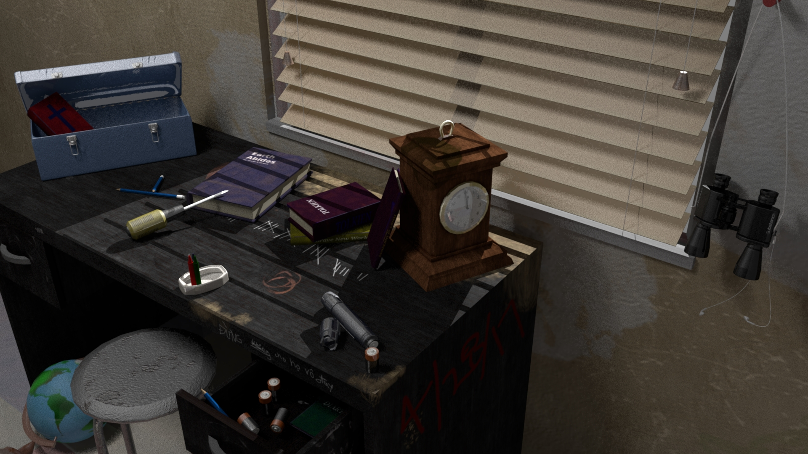

    <h3>Summary</h3>
    

        Objects made in Maya and rendered with Mental Ray (Pencil was rendered in Substance Painter). Textured with Substance Painter.
         
        Post-apocalyptic themed.
         
        3D modeling can be very tedious and frustrating. The results are satsifying to see though.
    

<figure class="image-body image-body-large">
    <figcaption>Post-apocalptic themed render with gathered objects I've made overtime.</figcaption>
</figure>