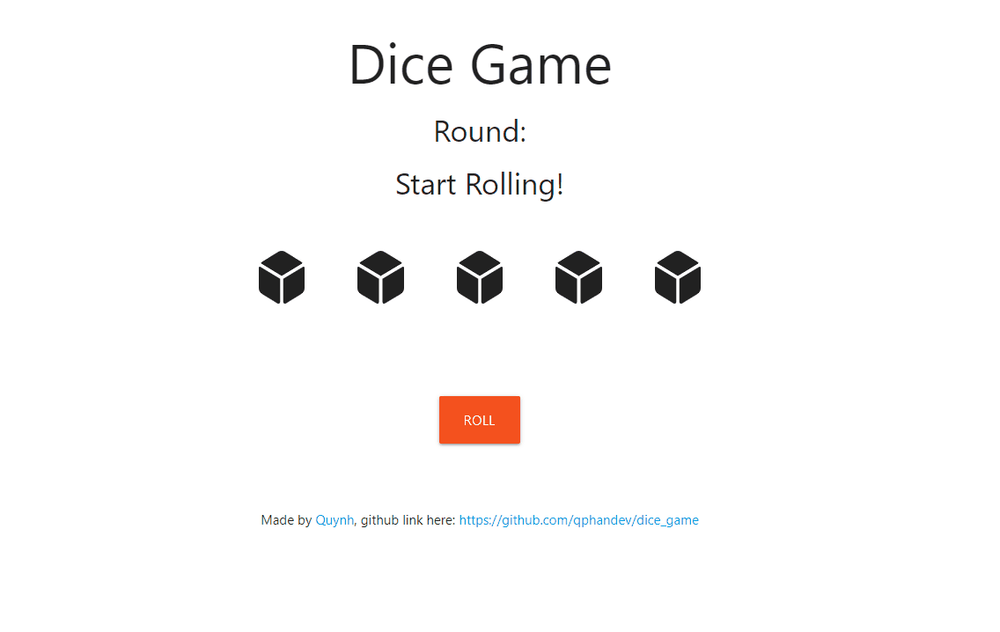

<figure class="image-body image-body-large">
    
</figure>

    <h3>Summary</h3>
    

        Try to get all matching rolls to win(e.g. all die must be the same number face)
         
        It drove me kind of nuts when components didn't render after their props were updated along with all sorts of bugs in my code. My main struggle was merging my logic with React syntax and behavior that I knew little about.
         
        Source code: https://github.com/qphandev/dice_game
    

